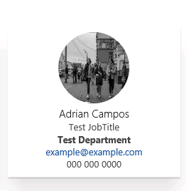

# SP - ContactCard

## Summary
Simple react contact card based on [web-library-build](https://github.com/Microsoft/web-library-build).



## Applies to

* SharePoint Online
* SharePoint 2016
* SharePoint 2013
* (SharePoint 2010)

## Prerequisites
You will need to have Node.js installed on your development box. 
You can for example follow the SPFx d


## How to use in development?


- `npm install`
- `gulp serve`

Add following to script editor web part in SharePoint 2016 or 2013. 

```javascript

<!-- Style -->
<link rel="stylesheet" href="https://appsforoffice.microsoft.com/fabric/fabric-core/4.0.0/fabric.min.css">
 
<!-- Change the value of data-accountid to match account id to be shown -->
<div class="webpart-contactcard" data-accountid="0"></div>
 
<!-- Dependencies -->
<script src="http://localhost:4321/node_modules/react/dist/react.js"></script>
<script src="http://localhost:4321/node_modules/react-dom/dist/react-dom.js"></script>
 
<!-- Main -->
<script src="http://localhost:4321/dist/contactcard.js"></script>

```


If used in context of SharePoint 2010, you'll need to use content editor web part and reference the needed script from a txt file, so that script tags are rendering properly.

> Notice. When you have gulp serve running, you can perform edits for example with Visual Studio Code to the files and you'll see the changes after page refresh in the context of SharePoint.

## How to deploy to production?
* Deploy react.js, react-dom.js, and contactcard.js to some centralized location, for example SharePoint library accessed for everyone. 
* Update references in the script editor part to point to this location.

> Technically you'd only need to reference react and styling referenced once in the page. So if you are using multiple instances of the web part, you can reference JS and CSS files in one instance and keep the script editor entry only with the reference to app specific script.
